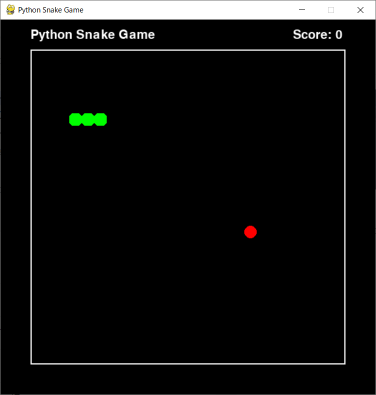

# Python-Snake-Game

Pythonの学習のため、Pygameを使って作成したシンプルなSnakeゲームです。

## 遊び方

タイトル画面が表示され、Enterキーでゲームが開始します。
矢印キーを使ってヘビ（緑の四角形）を動かします。
フード（赤い丸）を食べるとスコアが増え、ヘビの体が伸びます。
壁や自分の体にぶつかるとゲームオーバーです。
ゲームオーバー後、Enterキーを押してタイトル画面に戻り、再度ゲームを開始することができます。